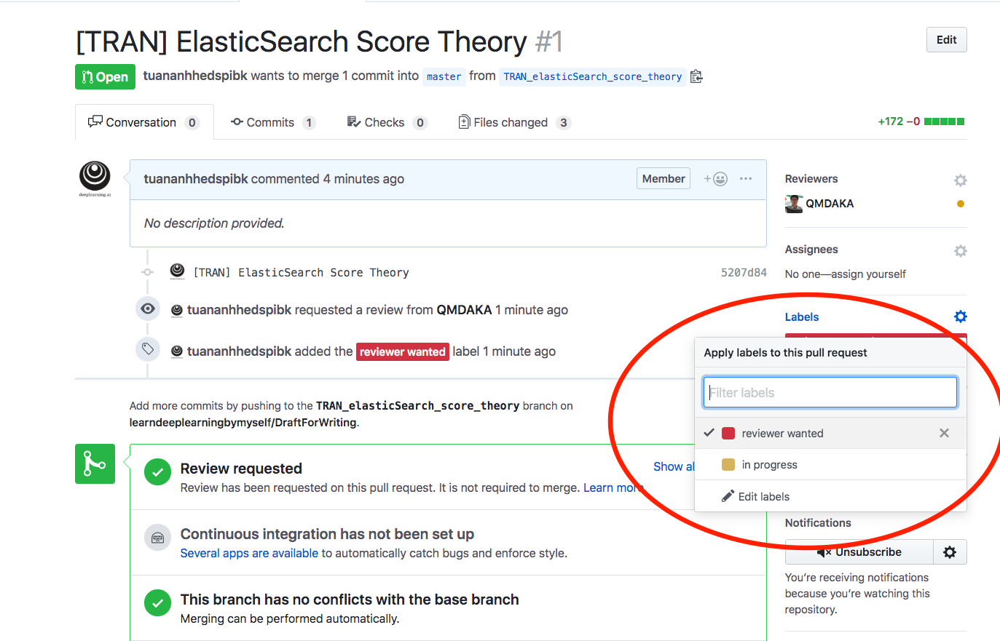
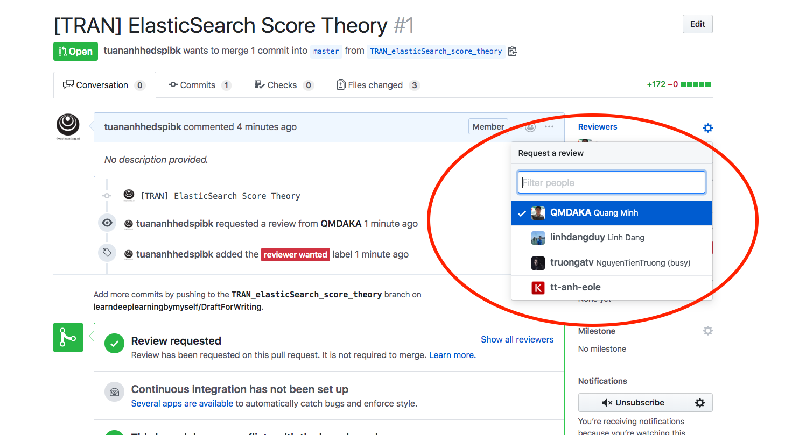

## Lưu ý khi viết

1. Một commit là một bài viết (Mỗi bài viết không được có từ 2 commits trở lên)

2. Commit theo mẫu: **[Loại_bài_viết] Tên bài viết**

3. Tách nhánh riêng của mình khi push bài viết - Sau đó tạo pull để merge vào nhánh **master** (Tránh tình trạng nhiều bài viết chung 1 nhánh - Dễ conflict lung tung). Tên của nhánh: **Loại_bài_viết_Tên_bài_viết**. Tên của pull: **[Loại_bài_viết] Tên bài viết**

```
Có 3 loại bài viết:
- Dịch: Translate - TRANS
- Tự học: Today I learned - TIL
- Chia sẻ kiến thức - Share Knowledge - SHKN

Tên của bài viết có thể viết Tiếng Anh hoặc Tiếng Việt tuỳ người viết.
```

4. Khi tạo pull, cần thêm người review và đánh nhãn như 2 hình dưới

```
reviewer wanted: Viết xong thì cần người review, nếu người review mà OK thì sẽ merge vào master

inprogress: Là đang viết dở, chưa hoàn thành.
```

- Đánh nhãn cho pull:



- Thêm người review:


